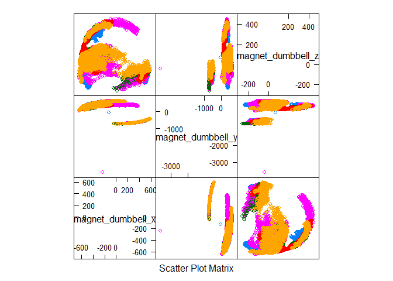
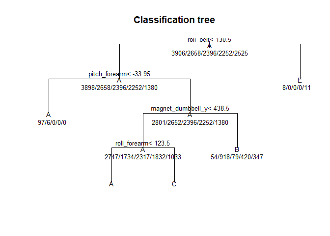

### Summary

Accelerometer sensor on the belt, forearm, arm and dumbell of six
participants performing dumbell lifts correctly and incorrectly is
obtained from weight lifting dataset (
<a href="http://groupware.les.inf.puc-rio.br/har" class="uri">http://groupware.les.inf.puc-rio.br/har</a>).
The data is used to predict lifting categories such as lifting correctly
(Class A),throwing the elbows to the front (Class B), lifting the
dumbbell only halfway (Class C), lowering the dumbbell only halfway
(Class D) and throwing the hips to the front (Class E). Here, two
methods namely random forest and decision trees are used for predicting
the lifting category. Following document describes the procedure adopted
and the relevant ‘r’ code for the same.

Following relevant libraries are used:

    library(caret)

    ## Warning: package 'caret' was built under R version 3.6.3

    ## Loading required package: lattice

    ## Loading required package: ggplot2

    ## Warning: package 'ggplot2' was built under R version 3.6.3

    library(randomForest)

    ## Warning: package 'randomForest' was built under R version 3.6.3

    ## randomForest 4.6-14

    ## Type rfNews() to see new features/changes/bug fixes.

    ## 
    ## Attaching package: 'randomForest'

    ## The following object is masked from 'package:ggplot2':
    ## 
    ##     margin

### Getting the data

Training and testing csv data is dowloaded read as follows:

    # creating data file in case it does not exist
    if (!file.exists("data")){
      dir.create("data")
    }

    # load csv files 
    download.file("https://d396qusza40orc.cloudfront.net/predmachlearn/pml-training.csv", destfile ="./data/training.csv")
    download.file("https://d396qusza40orc.cloudfront.net/predmachlearn/pml-testing.csv", destfile ="./data/testing.csv")

    training <- read.csv("./data./training.csv", stringsAsFactors = F)
    testing <- read.csv("./data./testing.csv", stringsAsFactors = F)

Test and train data are loaded. Their dimensions are as follows:

    dim(training)

    ## [1] 19622   160

    dim(testing)

    ## [1]  20 160

### Cleaning the data

Training data has 19622 entries adn 160 columns. Not all columns are
required for analysis. The dataset is cleaned for the purpose of
analysis.

    rmcol <- grepl("^X|user|time|window|kurtosis|skewness|max|min|amplitude|var|avg|stddev", colnames(training))
    training2 <- training[, rmcol == FALSE]
    testing2 <- testing[, rmcol == FALSE]
    training2$classe <- as.factor(training2$classe)

Now both the train and test data set have 53 columns. The last column
for train data set is called ‘classe’, which is nothing but the lifting
category. Now, lets see the plot of differnt lifting type with respect
to accelerometer readings for dumbell.

    featurePlot(x = training2[, c("magnet_dumbbell_x", "magnet_dumbbell_y", "magnet_dumbbell_z")], y = training2$classe, plot = 'pairs', labels = T)

From the plot it is observed that there exists differences between
sensor readings for differnt lifting type. Now, lets examine the
correlation between differnt sensor readings.

    corr <- abs(cor(training2[,-53]))
    diag(corr) <- 0 
    which(corr > 0.8,arr.ind=T)

    ##                  row col
    ## yaw_belt           3   1
    ## total_accel_belt   4   1
    ## accel_belt_y       9   1
    ## accel_belt_z      10   1
    ## accel_belt_x       8   2
    ## magnet_belt_x     11   2
    ## roll_belt          1   3
    ## roll_belt          1   4
    ## accel_belt_y       9   4
    ## accel_belt_z      10   4
    ## pitch_belt         2   8
    ## magnet_belt_x     11   8
    ## roll_belt          1   9
    ## total_accel_belt   4   9
    ## accel_belt_z      10   9
    ## roll_belt          1  10
    ## total_accel_belt   4  10
    ## accel_belt_y       9  10
    ## pitch_belt         2  11
    ## accel_belt_x       8  11
    ## gyros_arm_y       19  18
    ## gyros_arm_x       18  19
    ## magnet_arm_x      24  21
    ## accel_arm_x       21  24
    ## magnet_arm_z      26  25
    ## magnet_arm_y      25  26
    ## accel_dumbbell_x  34  28
    ## accel_dumbbell_z  36  29
    ## gyros_dumbbell_z  33  31
    ## gyros_forearm_z   46  31
    ## gyros_dumbbell_x  31  33
    ## gyros_forearm_z   46  33
    ## pitch_dumbbell    28  34
    ## yaw_dumbbell      29  36
    ## gyros_forearm_z   46  45
    ## gyros_dumbbell_x  31  46
    ## gyros_dumbbell_z  33  46
    ## gyros_forearm_y   45  46

19 of the variables have corelation value greater than 0.8. In order to
predict the type of lifting, it is required to build a suitable machine
learning model.

### Splitting the data

The training data that was previously dowloaded, is split as training
and testing data with splitting ratio of 0.7.

    intrain <- createDataPartition(y = training2$classe, p = 0.7, list = F)
    train_data <- training2[intrain,]
    test_data <- training2[-intrain,]

### Test control

Following test control are used for the model:

    set.seed(123)
    # test control
    control <- trainControl(method='repeatedcv', number = 10, repeats = 3, search = 'grid')

### Model 1 : Decision trees

The first model that is fitted is the dicision trees. The prediction
model is used for predicting the lifting type for test data set.

    model_rpart <- train(classe ~., data = train_data, method = 'rpart', trControl = control)

It is possible to view the trees as follows:

    # view trees
    plot(model_rpart$finalModel, uniform = T, main = 'Classification tree')
    text(model_rpart$finalModel, use.n = T, all = T, cex = 0.8)

The predictions of the model for the test data is as follows:

    predictions <- predict(model_rpart, test_data)
    conf_rpart <- confusionMatrix(predictions, test_data$classe)
    conf_rpart$overall[1]

    ##  Accuracy 
    ## 0.4893798

    conf_rpart$table

    ##           Reference
    ## Prediction    A    B    C    D    E
    ##          A 1508  462  485  462  154
    ##          B   33  375   30  152  143
    ##          C  127  302  511  350  299
    ##          D    0    0    0    0    0
    ##          E    6    0    0    0  486

The accuracy of the model is around 0.50.

### Model2 : random forest

Similar to the previous model, random forest is used for prediction of
lifting type for the test data.

    model_rf <- randomForest(classe ~., data = train_data, trControl = control)
    predictions <- predict(model_rf, test_data)
    conf_rf <- confusionMatrix(predictions, test_data$classe)
    conf_rf$overall[1]

    ##  Accuracy 
    ## 0.9938828

    conf_rf$table

    ##           Reference
    ## Prediction    A    B    C    D    E
    ##          A 1672   10    0    0    0
    ##          B    1 1127    4    0    0
    ##          C    0    2 1021   12    0
    ##          D    0    0    1  950    3
    ##          E    1    0    0    2 1079

The model has prediction accuracy of 0.99. Hence, it performs better
than decision trees model.This model is used for predicting lifting type
for the previously downloaded testing data.

    prediction_test <- predict(model_rf, testing2)
    prediction_test

    ##  1  2  3  4  5  6  7  8  9 10 11 12 13 14 15 16 17 18 19 20 
    ##  B  A  B  A  A  E  D  B  A  A  B  C  B  A  E  E  A  B  B  B 
    ## Levels: A B C D E

Reference: Velloso, E.; Bulling, A.; Gellersen, H.; Ugulino, W.; Fuks,
H. Qualitative Activity Recognition of Weight Lifting Exercises.
Proceedings of 4th International Conference in Cooperation with SIGCHI
(Augmented Human ’13) . Stuttgart, Germany: ACM SIGCHI, 2013.
